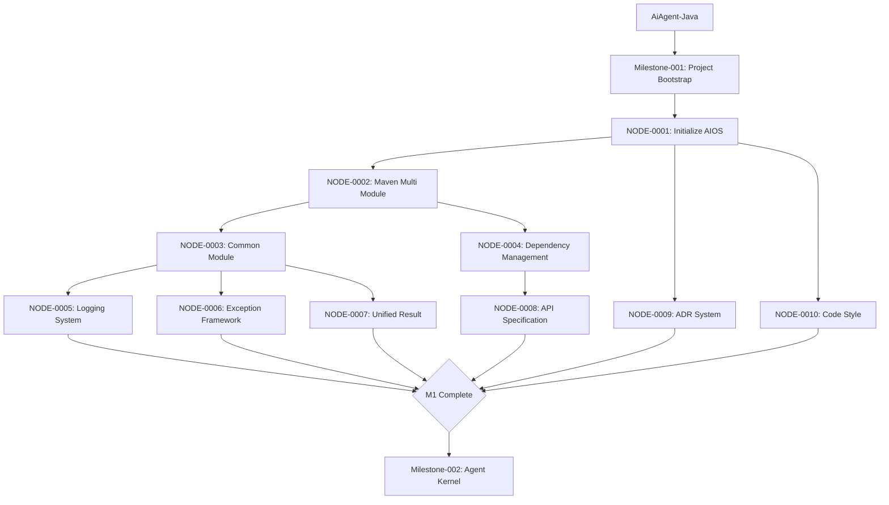

# EXECUTION_GRAPH

> Document ID: AIOS-EXEC-001
>
> Version: 1.0.0
>
> Status: Stable

---

# Purpose

Execution Graph 是整个 AiAgent-Java 的唯一执行入口。

所有 AI（Qoder、Cursor、Claude Code、Copilot 等）在开始任何开发工作之前，都必须读取 Execution Graph。

Execution Graph 描述：

- 项目开发路线
- 任务依赖关系
- 可并行任务
- 禁止执行任务
- 当前状态
- 下一阶段

Execution Graph 是整个项目的事实来源（Single Source of Truth）。

---

# Core Principles

Execution Graph 遵循：

1. Single Source of Truth
2. Dependency First
3. Architecture First
4. Documentation First
5. Review Required
6. Test Required
7. Never Break Dependency

---

# Execution Model

所有开发必须按照：

```
Project → Milestone → Execution Node → Deliverables → Review → Release
```

禁止直接开发 Java。

必须先满足 Execution Node。

---

# Execution Node

Execution Node 表示一个可执行节点。

每个节点必须包含：

- Node ID
- Title
- Milestone
- Priority
- Dependencies
- Required Reading
- Deliverables
- Acceptance
- Status
- Next Nodes
- Owner
- Commit Message

---

# Node Status

节点状态：

```
PLANNED → READY → RUNNING → REVIEW → TESTING → DONE → RELEASED
```

任何节点不得跳过 REVIEW。

---

# Dependency Rules

节点必须声明 Dependencies。

示例：

```
NODE-003
  Dependencies: NODE-001, NODE-002
```

只有全部完成，节点才能进入 READY。

---

# Parallel Rules

允许多个节点同时执行。

例如：

```
                NODE-002
               /
NODE-001 ─────
               \
                NODE-003
```

NODE-002 与 NODE-003 互不依赖，允许 Parallel Execution。

---

# Merge Rules

多个节点可以 Merge。

例如：

```
NODE-004 ──┐
           ├──→ NODE-006
NODE-005 ──┘
```

NODE-006 必须等待 NODE-004 与 NODE-005 全部完成。

---

# Execution DAG

项目整体执行 DAG：



Execution Graph 必须保持 DAG。

禁止循环。

---

# Required Reading Rules

任何 Node 必须声明 Required Reading。

示例：

```
Required Reading:
  - .ai/00_PROJECT/PROJECT.md
  - .ai/01_ARCHITECTURE/SYSTEM_ARCHITECTURE.md
  - .ai/02_RULES/JAVA_RULES.md
  - .ai/02_RULES/DIRECTORY_RULES.md
```

如果 Required Reading 不存在，禁止执行。

---

# Deliverables

每个 Node 必须输出：

- Markdown
- Java
- SQL
- Mermaid
- Test
- Commit

不得输出部分成果。

---

# Completion Definition

节点完成必须满足：

- ✓ Deliverables 完成
- ✓ Compile 通过
- ✓ Unit Test 通过
- ✓ Review 通过
- ✓ Documentation 更新
- ✓ Mermaid 可渲染
- ✓ Changelog 更新

否则 Status 不得标记 DONE。

---

# Forbidden

禁止：

- ❌ 跳过 Dependency
- ❌ 跳过 Required Reading
- ❌ 修改 Architecture
- ❌ 修改 Module Boundary
- ❌ 创建 Circular Dependency
- ❌ 修改其他 Milestone
- ❌ 直接生成 Java
- ❌ 跳过 Documentation

---

# AI Execution Flow

```
AI 启动
    ↓
读取 PROJECT
    ↓
读取 Architecture
    ↓
读取 Rules
    ↓
读取 Execution Graph
    ↓
找到 READY Node
    ↓
读取 Required Reading
    ↓
执行
    ↓
更新 Status
    ↓
更新 History
    ↓
Commit
    ↓
等待 Next Node
```

---

# Node Metadata

每个 Node 必须包含：

| Field | Description |
|-------|-------------|
| Node ID | 唯一标识 |
| Title | 节点标题 |
| Priority | P0 ~ P3 |
| Milestone | 所属里程碑 |
| Owner | 负责人 |
| Dependencies | 前置依赖节点 |
| Required Reading | 必读文档列表 |
| Deliverables | 交付物清单 |
| Acceptance | 验收标准 |
| Commit | 提交信息 |
| Reviewer | 审查人 |
| Status | 当前状态 |
| Created Time | 创建时间 |
| Updated Time | 更新时间 |

---

# Milestone-001 Execution Nodes

| Node | Title | Priority | Status | Dependencies | Next Nodes |
|------|-------|----------|--------|--------------|------------|
| NODE-0001 | Initialize AIOS | P0 | DONE | None | NODE-0002, NODE-0009, NODE-0010 |
| NODE-0002 | Maven Multi Module | P0 | DONE | NODE-0001 | NODE-0003, NODE-0004 |
| NODE-0003 | Common Module | P0 | DONE | NODE-0002 | NODE-0005, NODE-0006, NODE-0007 |
| NODE-0004 | Dependency Management | P0 | DONE | NODE-0002 | NODE-0008 |
| NODE-0005 | Logging System | P1 | DONE | NODE-0003 | M1 Complete |
| NODE-0006 | Exception Framework | P1 | DONE | NODE-0003 | M1 Complete |
| NODE-0007 | Unified Result | P1 | READY | NODE-0003 | M1 Complete |
| NODE-0008 | API Specification | P1 | READY | NODE-0004 | M1 Complete |
| NODE-0009 | ADR System | P2 | READY | NODE-0001 | M1 Complete |
| NODE-0010 | Code Style | P1 | READY | NODE-0001 | M1 Complete |

---

# Current Status

**Active Node:** NODE-0007 (Unified Result), NODE-0008 (API Specification), NODE-0009 (ADR System), NODE-0010 (Code Style)

**Ready Nodes:** NODE-0007, NODE-0008, NODE-0009, NODE-0010

**Blocked Nodes:** None

---

# Future

Execution Graph 将支持：

- GitHub Project
- GitHub Issues
- Mermaid DAG
- Jira
- Azure DevOps
- Automatic Planning
- Automatic Dependency Detection
- Automatic Task Scheduling
- Automatic Merge
- Automatic Progress Dashboard
