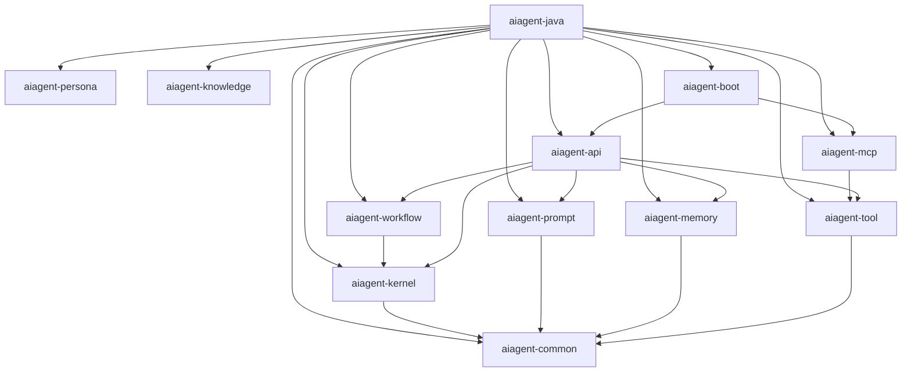

# Module Architecture

## Purpose

Defines the Maven multi-module structure of AiAgent-Java.

## Scope

Applies to all Maven modules within `source/`.

## Design Principles

- Single Responsibility per module
- Explicit Dependencies
- API Separation from implementation
- Testability in isolation

---

## 1. Module Structure

## 2. Module Definitions

| Module | Responsibility | Depends On |
|--------|---------------|------------|
| aiagent-common | Shared utilities, base types | Nothing |
| aiagent-kernel | Core agent execution engine | common |
| aiagent-prompt | Prompt construction pipeline | common |
| aiagent-memory | Multi-layer memory system | common |
| aiagent-tool | Tool registration and invocation | common |
| aiagent-workflow | Graph-based workflow orchestration | kernel, common |
| aiagent-persona | Agent persona management | common |
| aiagent-knowledge | Knowledge base and RAG | common |
| aiagent-mcp | MCP integration | tool, common |
| aiagent-api | REST and WebSocket APIs | kernel, prompt, memory, tool, workflow |
| aiagent-boot | Spring Boot auto-configuration | All modules |

## Forbidden

- Circular dependencies between modules
- Modules depending on aiagent-boot
- Sharing implementation classes between modules