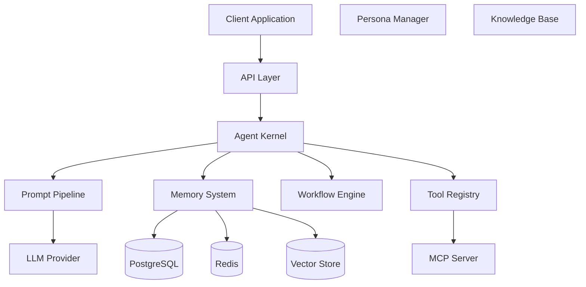
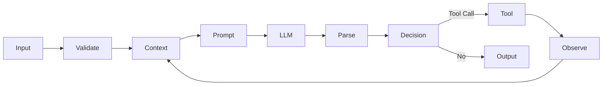

# System Architecture

## Purpose

Defines the overall system architecture of AiAgent-Java.

## Scope

Applies to all modules, components, and their interactions.

## Design Principles

- Layered Architecture with unidirectional dependencies
- Modular Design with single responsibility
- Dependency Inversion
- Event-Driven communication
- Pluggability through interfaces

---

## 1. Architecture Overview

## 2. Layer Definitions

| Layer | Responsibility |
|-------|---------------|
| API Layer | REST, WebSocket, MCP endpoints |
| Agent Kernel | Core execution engine |
| Prompt Pipeline | Prompt construction and transformation |
| Memory System | Short-term, long-term, episodic memory |
| Workflow Engine | Graph-based orchestration |
| Tool Registry | Tool discovery and invocation |
| Persona Manager | Agent persona configuration |
| Knowledge Base | RAG and document ingestion |

## 3. Data Flow

## Forbidden

- Creating circular dependencies between layers
- Placing business logic in the API layer
- Direct database access from outside Memory/Knowledge modules
- Bypassing the Prompt Pipeline when calling LLMs