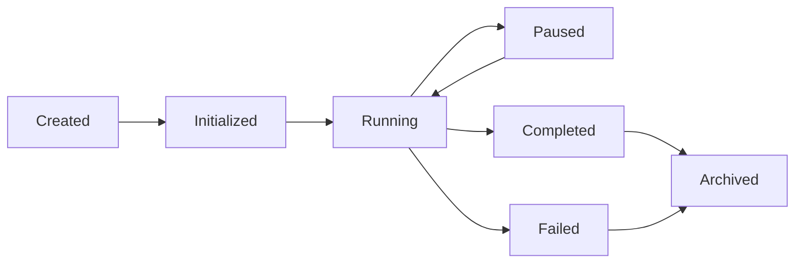
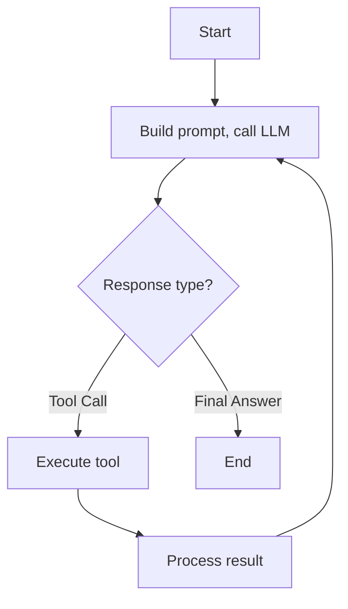

# Agent Kernel

## Purpose

Defines the core agent execution engine.

## Scope

The `aiagent-kernel` module.

## Design Principles

- Simplicity, Extensibility, Isolation, Observability

---

## 1. Agent Lifecycle

## 2. Execution Loop: Think-Act-Observe

## 3. Agent Context: agentId, sessionId, userInput, variables, messages, toolResults, state, metadata

## 4. Loop Controls: maxIterations=10, timeout=30s, retryCount=3

## 5. Events: AgentStarted, AgentCompleted, AgentFailed, ToolCall, ToolResult, LLMCall, LLMResponse, Iteration

## Forbidden

- LLM-specific logic in kernel
- Blocking indefinitely
- Sharing context between executions